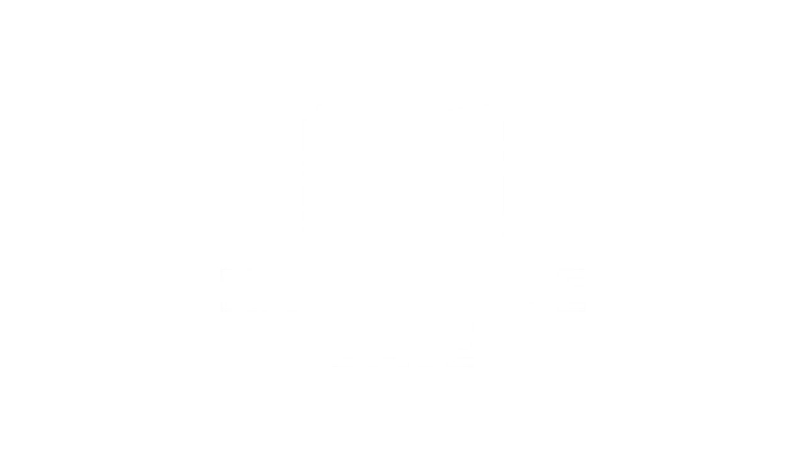

# 🧠 Offensive Security Knowledge Base

A structured, no-fluff, high-impact knowledge base for offensive security professionals.  
This repository contains curated notes on Active Directory, certificate abuse, OT/ICS systems, tools, protocols, and more — built from real-world experience and training labs.

## 📚 What's Inside

This vault covers:
- ✅ Active Directory internals and attack paths (Kerberos, delegation, etc.)
- ✅ Certificate Services (ESC1–ESC16, PKINIT, Certipy usage)
- ✅ Windows and AD enumeration tools and techniques
- ✅ ICS/OT fundamentals (PLCs, Modbus, BACnet, BMS, etc.)
- ✅ Core infrastructure components (Docker, APIs, Jenkins, Tomcat, etc.)
- ✅ Real offensive TTPs with theory + tooling (where applicable)

## 🧩 Structure

Notes are kept modular — each concept, tool, or attack gets its own atomic file.  
Where appropriate, command-line examples, theory, and references (like Hacker Recipes) are included.

## 🔧 Usage

This repo is meant to be cloned into your Obsidian vault or referenced externally.  
It’s designed for quick lookups and deep understanding — not passive reading.

## 🧠 Why?

Too many KBs are bloated, shallow, or outdated.  
This one is:
- ✍️ Written manually, by a practitioner
- 🧠 Meant for building real-world mental models
- 💣 Focused on **what matters during ops**, not filler

